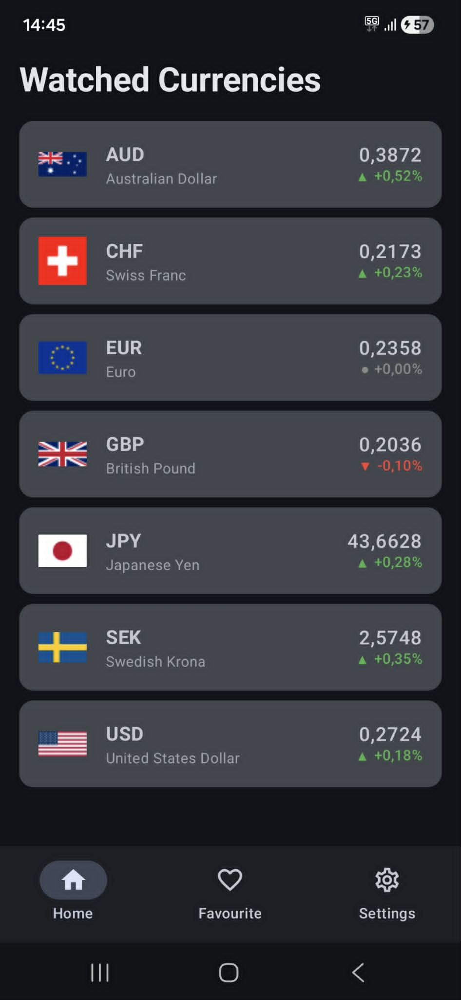
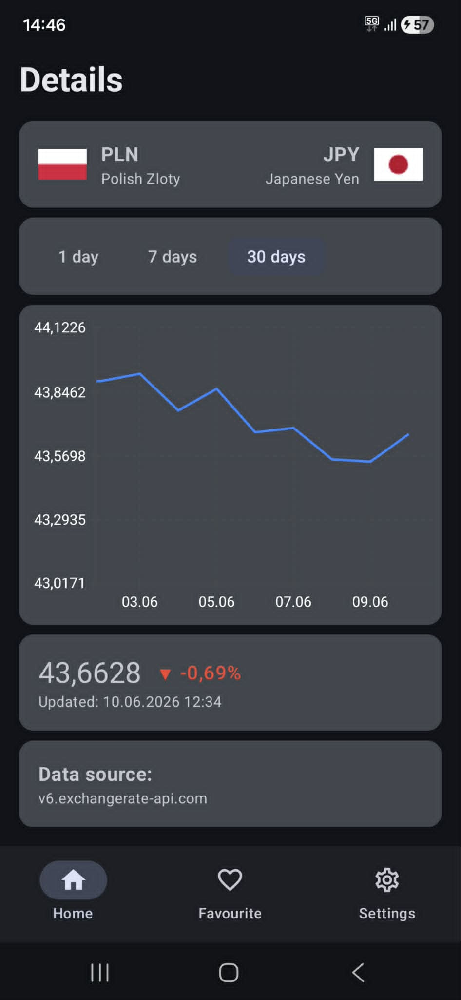
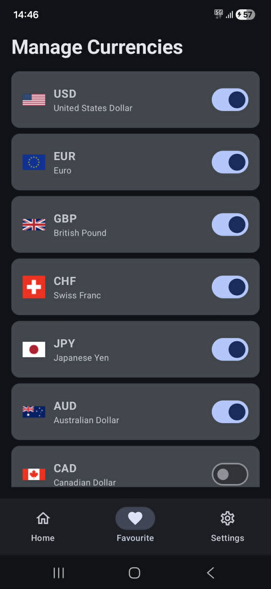
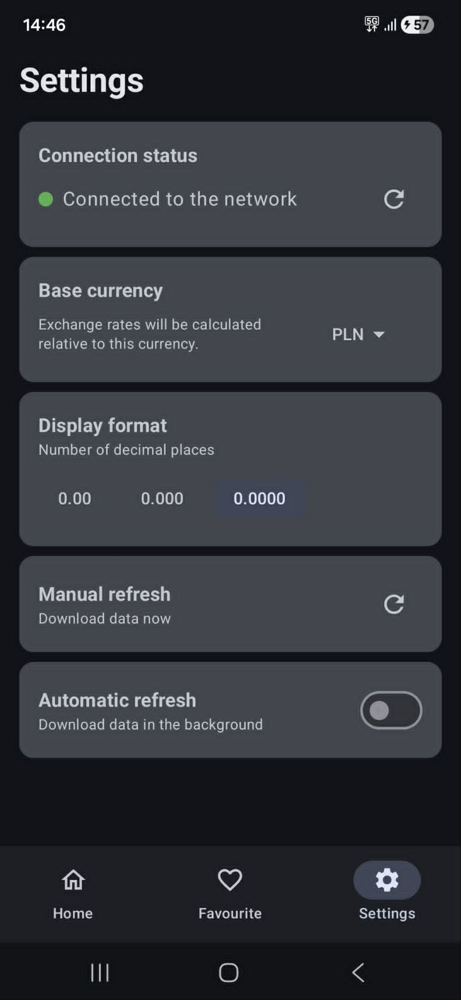

# 💱 Currency Exchange Rate App

A modern Android application for tracking current and historical currency exchange rates. The project was written in **Kotlin** using the fully declarative **Jetpack Compose** UI toolkit and modern mobile app architecture.

### 🌟 Key Features

* **Live Currency Tracking:** View real-time exchange rates for your selected base currency.
* **Historical Charts (Vico):** Detailed view of each currency with an interactive line chart presenting data from 1, 7, or 30 days.
* **Offline Mode:** The app automatically caches recently fetched data. If there is no internet connection, it displays a warning and loads data from the local cache.
* **Favorite Currencies:** Personalize your home screen by pinning and unpinning selected currencies (includes country flag support).
* **Background Work (WorkManager):** Optional, automatic background rate refreshing with a configurable time interval (e.g., every 15 minutes) or forced manual refresh.
* **Advanced Settings:** Change the base currency, adjust the display format (number of decimal places), and manage the refresh frequency.

---

### Screens

<div align="center">
  
  
  
  
</div>

---

### 🛠 Technologies and Libraries

The application utilizes a modern Android tech stack:
* **Language:** Kotlin
* **UI:** Jetpack Compose, Material Design 3
* **Architecture:** MVVM (Model-View-ViewModel) using Kotlin Flow / StateFlow
* **Networking:** Retrofit2 + Gson for API communication
* **Local Storage:** 
  * `DataStore Preferences` (app settings and favorites)
  * `EncryptedSharedPreferences` (secure storage for API key and sensitive data)
* **Background Tasks:** WorkManager (CoroutineWorker)
* **Charts:** Vico Compose (interactive and smooth charts)
* **Media:** Coil (asynchronous network loading of country flags)

---

### 🔑 API Configuration (Required to Run)

The app fetches exchange rate data from **ExchangeRate-API**. For the project to work correctly on your device, you must generate your own free API key and add it to the code.

**Step 1: Get an API Key**
1. Go to: 👉 [https://app.exchangerate-api.com/keys](https://app.exchangerate-api.com/keys)
2. Create a free account or log in.
3. Copy your generated API key.

**Step 2: Add the Key to the Project**
Open the `MainActivity.kt` file located at:
`app/src/main/java/com/example/currencyexchangerateapp/MainActivity.kt`

Find the following code snippet in the `onCreate` method and replace `api-key-here` with your copied key (remember to add quotes `"Your-Key"` if the syntax requires it):

```kotlin
val currentKey = settingsManager.getApiKey()

if (currentKey.isEmpty()) {
    // REPLACE THE TEXT BELOW WITH YOUR API KEY
    settingsManager.saveApiKey("PASTE_YOUR_KEY_HERE")
}
```
*Note: The utilized `SettingsManager` uses `EncryptedSharedPreferences`, ensuring the key is securely encrypted in the device's storage.*

---

### 📱 Screen Structure

The application consists of 4 main views organized in a Bottom Navigation architecture:

1. **Home (MainScreen):** A grid of watched (favorite) currencies. Shows the current exchange rate relative to the base currency and the percentage change over time.
2. **DetailsScreen:** A detailed screen for the selected currency featuring an interactive historical chart, current rate, and data source information.
3. **FavouriteScreen:** A list of all available currencies with toggle switches to easily manage your home screen.
4. **SettingsScreen:** Manage the API key, background refresh, number format, network status, and base currency. Allows for forced data updates.

---

### 🚀 How to Run the Project Locally

1. Clone this repository to your computer.
2. Open the project in **Android Studio**.
3. Sync the Gradle files (the IDE should do this automatically).
4. Follow the instructions in the **API Configuration** section to provide your key.
5. Select an emulator or a physical device and click **Run** (Shift + F10).
